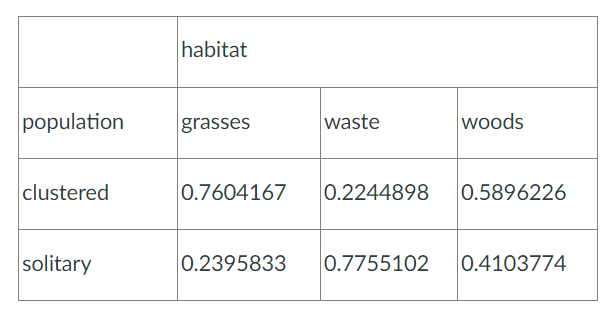

<style>hr{border: 1px solid black;}</style>

```{R setup, include=FALSE}
library(dplyr)
library(knitr)
```

---

# Question 14

### The table below shows frequencies by population (clustered or solitary) and habitat (grasses, waste, or woods) for a fictional sample of mushroom species. The table here shows column proportions corresponding to the frequency table.

<center>{width=50%}

 

### Which of the following statements are correct verbal interpretations of the proportions? Select all that are correct. (Two are correct.)

    A. About 41.04% of mushrooms in "woods" habitats are in "solitary" populations. 
    B. About 41.04% of mushrooms in "solitary" populations are in "woods" habitats. 
    C. Mushrooms in "clustered" populations are most likely to be found in "grasses" habitats. 
    D. Mushrooms found in "grasses" habitats are more likely to be in "clustered' than "solitary" populations. 


<span style="color: red;">Answers I chose on the Quiz were **[A, C]**.</span>

  - **My selection of A was correct.**
    - The proportion of mushrooms in the woods that are solitary is 41.04% (0.4103774) - the value in the "woods" column for solitary mushrooms.
    
  - **My selection of C was incorrect.**
    - This statement assumes that the proportions in the table represent where clustered mushrooms are found the most. 
    - However, the table shows proportions within each habitat for clustered and solitary mushrooms.
    - The 0.7604167 in the grasses column means that within the grasses habitat, 76.04% of the mushrooms are in clustered populations.
    - This does not tell us that clustered mushrooms are "most likely" to be found in grasses compared to other habitats.
    - For this statement to be correct, we would need the total numbers of clustered mushrooms across all habitats, which is not provided.


<span style="color: green;">Correct answers are **[A, D]**.</span>
    
  - **My selection of A was correct.**
    
  - **My new selection of D is now correct.**
    - Proportion of mushrooms in grasses that are clustered is 76.04%.
    - Proportion of mushrooms in grasses that are solitary is 23.96%.
    - Thus we can conclude that mushrooms found in grasses have a greater chance of being clustered (76%) vs in solitary (24%).

---

# Question 21

### Let $Y$ be a random variable from a $N(1.4, 1^{2})$ distribution.  Find the 95th percentile of the distribution.  Round your answer to three decimal places.

<span style="color: red;">My approach during the Quiz:</span>

```{R}
# Question 21
expected_answer <- round(3.0449, 3)
mu <- 1.4
sigma <- 1

# calculate the 95th percentile
q_95 <- quantile(rnorm(10000, mu, sigma), probs = 0.95)
q_95 <- round(q_95, 3)
```


**Is our function returning the correct answer?**
```{R echo=FALSE}
cat(">>> q_95 == expected_answer\n", q_95 == expected_answer)
```
<span style="color: red;">No! rnorm() with a sample size of 10,000 is coming close but will not give the exact correct answer.</span>


**Is our function returning a consistent answer for 95th percentile of N(1.4, 1^2)?**
```{R echo=FALSE}
# calculating the same equation for same normal distribution random sampling with same params
q_95_2 <- quantile(rnorm(10000, mu, sigma), probs = 0.95)
q_95_2 <- round(q_95_2, 3)

cat(">>> q_95\n",
    q_95,
    "\n>>> q_95_2 <- quantile(rnorm(10000, mu, sigma), probs=0.95)",
    "\n>>> q_95_2\n",
    q_95_2,
    "\n>>> q_95 == q_95_2\n",
    q_95 == q_95_2)
```

<span style="color: red;">No! Our function is giving different answers for each run.</span>


  - This code does not work because it uses simulation to approximate the percentile.
  
    - You can see this as the values of q_95 and q_95_2 are different even when calculated by the same parameters.
      - The accuracy depends on the number of samples (here, 10,000) and could introduce slight estimation error.
    - Unseeded run makes our starting point random.
    
  - Can seed and limit to sampling from one simulation.
  
    - Starting point would still be random but would be a single value shared across all runs of rnorm.
    - We are still using simulations to get approximation of percentile, this is not the best approach as we will never get an exact answer.
    
  - It would be better to use *qnorm()* to get the exact percentile.


<span style="color: green;">A corrected version of program using qnorm().</span>

```{R}
# Question 21
expected_answer <- round(3.0449, 3)
# mean and standard deviation
mu <- 1.4
sigma <- 1

# calculate the 95th percentile using qnorm
q_95 <- qnorm(0.95, mean = mu, sd = sigma)
q_95 <- round(q_95, 3)

# print the result
cat("95 Percentile of Normal Distribution (with mu=1.4, sigma=1): ",
    q_95,
    "\n>>> q_95 == expected_answer\n",
    q_95 == expected_answer)
```

  - This code gives an exact answer to the percentile.
  
    - Due to qnorm()'s analytical approach (using cumulative density function of Normal distribution).
      - Computationally efficient since no random samples are generated - so the result will be the same every time you run it.


---

# Question 28

### A researcher is planning an observational study on vitamin D deficiency in young adults.  She expects that most patients in the study will have vitamin D levels between 30 and 70 ng/mL, but that a small number will have deficiencies that result in values between 10 and 30 ngl/ml. In statistical terms, which of the following is accurate?

    A. She expects the distribution of vitamin D levels to be right-skewed. 
    B. She expects the distribution of vitamin D levels to be symmetric. 
    C. She expects the distribution of vitamin D levels to be left-skewed. 


<span style="color: red;">The answer I chose on the Quiz was **A. She expects the distribution of vitamin D levels to be right-skewed.**.</span>

  - A is not correct because...
  
    - A is a right-skewed distribution, meaning there are a few unusually large values that "pull" the tail of the distribution to the right.
      - Thus most of A's data points must be concentrated at the lower end of vitamin D levels, and there are some high outliers.
      
    - We are told the majority of vitamin D levels are expected to be between 30 and 70 ng/mL.
      - Since the lower end (10–30 ng/mL) represents vitamin D deficiency, there are no extremely high values that would cause the distribution to have a long right tail.
      - Thus, a right-skewed distribution of A is likely the opposite of what we are looking for.


<span style="color: green;">The correct answer was **C. She expects the distribution of vitamin D levels to be left-skewed.**.</span>

  - C is correct because...

    - Left-skewed distribution occurs when there are a few unusually low values that "pull" the tail of the distribution to the left, meaning that most of the data points are concentrated at the higher end, and there are some lower outliers.
      - We are told that there are some lower outliers already expected, in between the values of 10 and 30 ngl/ml.
      
    -  In this distribution scenario, the majority of vitamin D levels are expected to be between 30 and 70 ng/mL, with a few patients having lower levels (10–30 ng/mL).
      - Since the lower vitamin D levels (deficiency) are relatively rare and create a "tail" on the left side of the distribution, the distribution would be skewed to the left.


